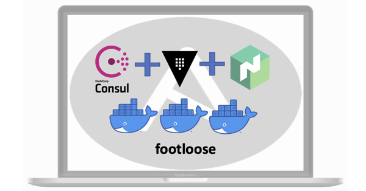
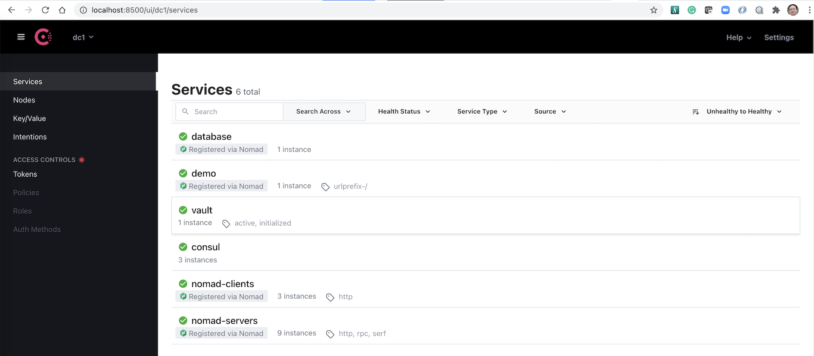
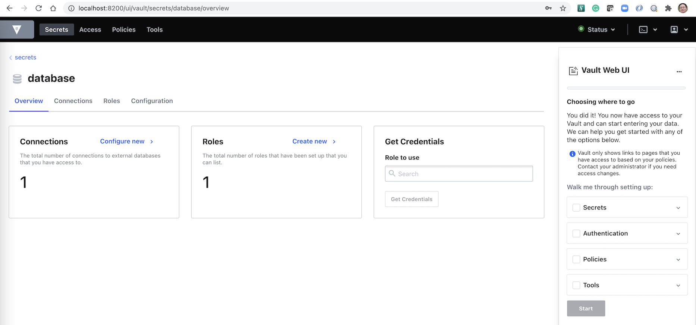
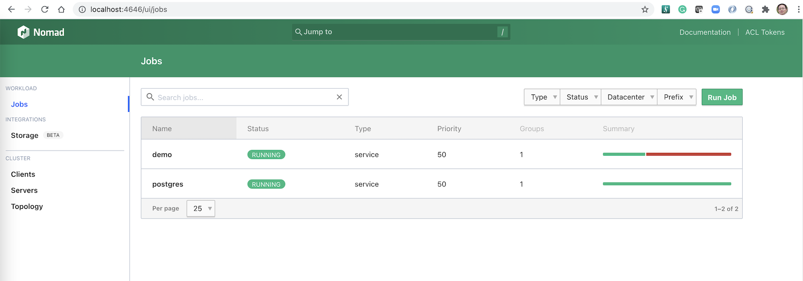

# HashiStack: Consul + Vault + Nomad Quick Setup Guide by Footloose & Ansible

This is a lightweight, semi-automated setup guide for [Consul](https://www.consul.io/), [Vault](https://www.vaultproject.io/), and [Nomad](https://www.nomadproject.io/) on [Footloose](https://github.com/weaveworks/footloose) powered Docker "container VMs", with [Ansible](https://github.com/ansible/ansible).

It's not meant for production, instead, it's more for building up a sandbox on one VM, or our laptop.



> Note: All these have been built and tested on my MBP, but your miles may vary.

## Prerequisites

These are the prerequisites and versions -- other versions may work too.

### Ansible

```sh
$ ansible --version
ansible [core 2.11.2]
  config file = None
  ...
  python version = 3.9.5 (default, May  4 2021, 03:36:27) [Clang 12.0.0 (clang-1200.0.32.29)]
  jinja version = 3.0.1
  libyaml = True
```

### Footloose

```sh
$ footloose version
version: 0.6.3
```

### Docker

```sh
$ docker version
Client:
 Version:           20.10.7
 ...

Server: Docker Engine - Community
 Engine:
  Version:          20.10.7
  ...
```


### Other tools

Having these tools can be very convenient as you can run commands directly from the laptop:

- `vault`, the Vault CLI, if you want to run Vault commands from the laptop
- `nomad`, the Nomad CLI, if you want to run Nomad commands from the laptop

```sh
$ vault version
Vault v1.7.3 ('5d517c864c8f10385bf65627891bc7ef55f5e827+CHANGES')

$ nomad version
Nomad v1.1.2
```

## Spin Up "VMs" by Footloose

```sh
# Create a dedicated Docker network
$ docker network create footloose-cluster

# Create the "VMs"
$ footloose create --config footloose.yaml
INFO[0000] Creating SSH key: cluster-key ...
INFO[0002] Docker Image: quay.io/footloose/ubuntu18.04 present locally
INFO[0002] Creating machine: sandbox-ubuntu-0 ...
INFO[0002] Connecting sandbox-ubuntu-0 to the footloose-cluster network...
INFO[0009] Creating machine: sandbox-ubuntu-1 ...
INFO[0009] Connecting sandbox-ubuntu-1 to the footloose-cluster network...
INFO[0015] Creating machine: sandbox-ubuntu-2 ...
INFO[0016] Connecting sandbox-ubuntu-2 to the footloose-cluster network...

# Have a check
$ docker ps
CONTAINER ID   IMAGE                           COMMAND        CREATED          STATUS          PORTS                                                                                                         NAMES
30b3b4509f60   quay.io/footloose/ubuntu18.04   "/sbin/init"   11 seconds ago   Up 5 seconds    0.0.0.0:49247->22/tcp, 0.0.0.0:4648->4646/tcp, :::4648->4646/tcp, 0.0.0.0:8502->8500/tcp, :::8502->8500/tcp   sandbox-ubuntu-2
aff78a966bea   quay.io/footloose/ubuntu18.04   "/sbin/init"   18 seconds ago   Up 12 seconds   0.0.0.0:49206->22/tcp, 0.0.0.0:4647->4646/tcp, :::4647->4646/tcp, 0.0.0.0:8501->8500/tcp, :::8501->8500/tcp   sandbox-ubuntu-1
3738eb18bdb7   quay.io/footloose/ubuntu18.04   "/sbin/init"   25 seconds ago   Up 19 seconds   0.0.0.0:4646->4646/tcp, :::4646->4646/tcp, 0.0.0.0:8500->8500/tcp, :::8500->8500/tcp, 0.0.0.0:49164->22/tcp   sandbox-ubuntu-0
```

> Note: other than the default SSH port `22`, here we also expose extra ports: Consul UI (`8500`), Vault UI (`8200`) and Nomad UI (`4646`), so that we can access these components' UI from the Docker host, which may be just our laptop.


## Set Up HashiStack Components

Before we do that, let's install the required Ansible roles first:

```sh
# Install Ansible roles
$ ansible-galaxy install --roles-path ~/.ansible/roles -r requirements.yaml

# List to double check
$ ansible-galaxy list
- brianshumate.vault, v2.5.2
- brianshumate.nomad, v1.9.5
- griggheo.consul-template, 1.2.5
- geerlingguy.docker, 3.1.2
- brianshumate.consul, v2.5.4
```

Please be aware that the installation of these components does matter, so please follow exactly the sequence.

### Consul

```sh
$ ansible-playbook playbooks/hashistack-consul.yaml
```

> Note: Access Consul UI from the Docker host, which in my case is my laptop: http://localhost:8500/

We need to fix the DNS issue -- please refer to [DNS Resolving](#dns-resolving) for details.

```sh
$ for i in 0 1 2; do
footloose ssh root@ubuntu-${i} --config footloose.yaml "echo -en 'nameserver 127.0.0.1 \noptions ndots:0 \n' > /etc/resolv.conf"
done
```


### Vault

```sh
$ ansible-playbook playbooks/hashistack-vault.yaml
```

> Note: Access Vault UI from the Docker host, which in my case is my laptop: http://localhost:8200/

By default the Vault is sealed, we must unseal Vault before proceeding to the next.

To unseal Vault by CLI:

```sh
# Expose the right address as we're not on https://127.0.0.1:8200
$ export VAULT_ADDR=http://localhost:8200/

# Initialize Vault server
# Do note down two important stuff from the output to a safe place:
# - Unseal Key 1: QVvj/YGLHyFEHbuKEyO5c5RPuabtr/QkUfGtvAzHcgg=
# - Initial Root Token: s.LreuBr3b0b3IHI9fVFQCeaSx
$ vault operator init -key-shares=1 -key-threshold=1

# Unseal Vault, use the Unseal Key generated above
$ vault operator unseal
```

Or unseal it through UI if you like:

- Access: http://localhost:8200/
- Key in `Key Shares` as `1` and `Key Threshold` as `1` in our case, click "Initialize"
- Click "Download Keys" to download the keys to local safe place, then click "Continue to unseal"
- Unseal Vault by using the `keys` token
- Now it's ready to sign in, try using `root_token` to sign in

> Note: Do remember that you will have to unseal Vault every time you restart it.


### Nomad

#### Prepare Vault Integration

Integrating Nomad with Vault is important, and having a properly configured, non-root token is highly recommended.

> Note: We can run below commands within the Docker host, or our laptop in my case.

```sh
# Login Vault, use the Initial Root Token generated above
$ vault login

# Create a policy for Nomad
$ vault policy write nomad-server integration/nomad-server-policy.hcl

# Create a token role
$ vault write /auth/token/roles/nomad-cluster @integration/nomad-cluster-role.json

# Generate the token for the Nomad server
$ vault token create -policy nomad-server -period 72h -orphan
```

You should be able to see something like this:

```
Key                  Value
---                  -----
token                s.8DdCyGgJFCJnuCkKxjxaok5X
token_accessor       5eHXXlBn4gNQd3SRIZ2wALRU
token_duration       72h
token_renewable      true
token_policies       ["default" "nomad-server"]
identity_policies    []
policies             ["default" "nomad-server"]
```

Now let's create a Ansible group variable named `nomad_instances`:

```sh
# Remove it if any
$ rm -f playbooks/group_vars/nomad_instances

# Create the encrypted token as group variable
$ ansible-vault create playbooks/group_vars/nomad_instances
```

Type a password (and remember it) and then in the prompted editor, key in this:

```yaml
---
nomad_vault_token: <The value of the token, e.g. s.8DdCyGgJFCJnuCkKxjxaok5X>
```

#### Spin Up Nomad (with Docker)

Now let's spin up Nomad cluster, together with Docker, as one of the supported Nomad task drivers.
When prompted for password, key in the Ansible Vault password we just created above.

```sh
$ ansible-playbook --ask-vault-pass playbooks/hashistack-nomad.yaml
```

> Note: Access Nomad UI from the Docker host, which in my case is my laptop: http://localhost:4646/

Till now, the core HashiStack components: Consul, Vault and Nomad have been setup. Let's verify!


## Configure and Run Sample Apps

Some use cases must be covered while designing the sample apps:

1. Docker driver is used;
2. Vault can be integrated for Nomad jobs;
3. Service can be discoverd by Consul.

> Note: this example apps are originated from here: https://learn.hashicorp.com/tutorials/nomad/vault-postgres?in=nomad/integrate-vault

### Deploy Nomad Job: Postgres

```sh
# Deploy postgres
$ nomad run apps/postgres.nomad

# Verify it
$ nomad status postgres
```

You should be able to see something like:

```
ID            = postgres
Name          = postgres
Submit Date   = 2021-07-01T20:42:40+08:00
Type          = service
Priority      = 50
Datacenters   = dc1
Namespace     = default
Status        = running
Periodic      = false
Parameterized = false

Summary
Task Group  Queued  Starting  Running  Failed  Complete  Lost
db          0       0         1        0       0         0

Latest Deployment
ID          = 6ae8fc72
Status      = successful
Description = Deployment completed successfully

Deployed
Task Group  Desired  Placed  Healthy  Unhealthy  Progress Deadline
db          1        1       1        0          2021-07-01T12:54:27Z

Allocations
ID        Node ID   Task Group  Version  Desired  Status   Created    Modified
673b62f0  93210d78  db          0        run      running  2m14s ago  27s ago
```

### Configure Vault

```sh
# Enable the database secrets engine
$ vault secrets enable database
Success! Enabled the database secrets engine at: database/

# Configure the database secrets engine
$ vault write database/config/postgresql @apps/connection.json

# Create a Vault role to manage database privileges
$ vault write database/roles/accessdb db_name=postgresql creation_statements=@apps/accessdb.sql default_ttl=1h max_ttl=24h
Success! Data written to: database/roles/accessdb

# Generate PostgreSQL credentials
$ vault read database/creds/accessdb
Key                Value
---                -----
lease_id           database/creds/accessdb/s7vzMEXKRhGyneT4CVFvHwTi
lease_duration     1h
lease_renewable    true
password           V4f4MMtaQ-bnqrgr78LC
username           v-root-accessdb-LriRAozES97kCfjOHe9y-1625196813
```

Cool! So we have configured Vault's connection to our database and can now generate credentials with the previously specified privileges.

We actually can verify this by logging into the Postgres Docker container, like this:

```sh
# Well, you might need to check Nomad UI for where this container is scheduled
# Let's assume it's on ubuntu-0
$ footloose ssh root@ubuntu-0 --config footloose.yaml

# List Docker containers
$ docker ps
CONTAINER ID   IMAGE                                  COMMAND                  CREATED         STATUS         PORTS                                                  NAMES
c1e5d0c3c408   hashicorp/postgres-nomad-demo:latest   "docker-entrypoint.s…"   3 minutes ago   Up 2 minutes   172.18.0.4:5432->5432/tcp, 172.18.0.4:5432->5432/udp   server-f8d496d4-b975-0605-e12b-d1c81f976da1

# Exec into the container
$ docker exec -it c1e5d0c3c408 bash

# Use Postgres CLI to log into the database, with
# - username and password from what we retrieve above by: vault read database/creds/accessdb
# - database name as what we specified as postgres
root@c1e5d0c3c408:/# psql -U v-root-accessdb-LriRAozES97kCfjOHe9y-1625196813 -W -d postgres
psql (11.0 (Debian 11.0-1.pgdg90+2))
Type "help" for help.

postgres=> \dt
         List of relations
 Schema |  Name  | Type  |  Owner
--------+--------+-------+----------
 public | people | table | postgres
(1 row)

postgres=> select * from people;
 firstname | lastname
-----------+-----------
 John      | Doe
 Peter     | Parker
 Clifford  | Roosevelt
 Bruce     | Wayne
 Steven    | Clark
 Mary      | Jane
(6 rows)

postgres=> \du
                                                      List of roles
                    Role name                    |                         Attributes                         | Member of
-------------------------------------------------+------------------------------------------------------------+-----------
 postgres                                        | Superuser, Create role, Create DB, Replication, Bypass RLS | {}
 v-root-accessdb-LriRAozES97kCfjOHe9y-1625196813 | Password valid until 2021-07-02 04:33:38+00                | {}
```

As you can see, the table has been created properly and user created by Vault is exactly there.

Now let's create `access-tables` policy for our Nomad jobs:

```sh
$ vault policy write access-tables apps/access-tables-policy.hcl
Success! Uploaded policy: access-tables
```

### Deploy Nomad Job: Web App

```sh
$ nomad run apps/webapp.nomad
```

### Verify

```sh
# Let's quickly install the dig
$ footloose ssh root@ubuntu-0 --config footloose.yaml "apt-get update & apt-get install -y dnsutils"

# Confirm the services are discoverable
$ footloose ssh root@ubuntu-0 --config footloose.yaml "dig +short SRV database.service.consul"
1 1 5432 ac120004.addr.dc1.consul.
$ footloose ssh root@ubuntu-0 --config footloose.yaml "dig +short SRV demo.service.consul"
1 1 25686 ac120004.addr.dc1.consul.

# Confirm the application is accessing the database
# Note: do remember to use the dynamic port allocated, in my case it's 25686
$ footloose ssh root@ubuntu-0 --config footloose.yaml "curl --silent demo.service.consul:25686/names"
```

You should be able to see the user list retrieved from Postgres database, something like:

```
<!DOCTYPE html>
<html>
<body>
<h1> Welcome! </h1>
<h2> If everything worked correctly, you should be able to see a list of names below </h2>
<hr>
<h4> John Doe </h4>
<h4> Peter Parker </h4>
<h4> Clifford Roosevelt </h4>
<h4> Bruce Wayne </h4>
<h4> Steven Clark </h4>
<h4> Mary Jane </h4>
</body>
<html>
```

So it all works perfectly fine!


## Some Screenshots

Consul:


Vault:


Nomad:


## Clean Up

To clean up, we can simply delete the Footloose container VMs:

```sh
$ footloose delete --config footloose.yaml
```


## Known Issues & Solutions

### DNS Resolving

If you're tying on `Ubuntu 18.04` by using `quay.io/footloose/ubuntu18.04` in [footloose.yaml](./footloose.yaml), you will encounter issue as the `systemd-resolvd` is on by default, so you have to disable `dnsmasq` and fix the DNS resolve issue between `systemd-resolvd` and `consul`, by following the doc, [here](https://learn.hashicorp.com/tutorials/consul/dns-forwarding?in=consul/networking#systemd-resolved-setup).

If you're tying on `Ubuntu 16.04` as what we do here, after enabling `dnsmasq`, we must update `/etc/resolv.conf` accordingly.

But why not using Ansible playbook? I prepared the [playbook](playbooks/hashistack-preparation.yaml) and tried but failed because of this error while we're using containers as VMs:
```log
An exception occurred during task execution. To see the full traceback, use -vvv. The error was: OSError: [Errno 16] Device or resource busy: b'/etc/.ansible_tmpar1lb52qresolv.conf' -> b'/etc/resolv.conf'
```

So the easiest way is to do this, as we've documented after spinning up Consul:
```sh
$ for i in 0 1 2; do
footloose ssh root@ubuntu-${i} --config footloose.yaml "echo -en 'nameserver 127.0.0.1 \noptions ndots:0 \n' > /etc/resolv.conf"
done
```

## Further Experiments

There are some more stuff for further experiments, which may include:

- Fully automate the process, if possible
- Make Vault highly available as a cluster within 3 nodes
- Enable TLS for secure communication among Consul, Vault and Nomad
- Enable more "advanced" features by default, like ACL
- Expose the add by a reverse proxy, or load balancer
